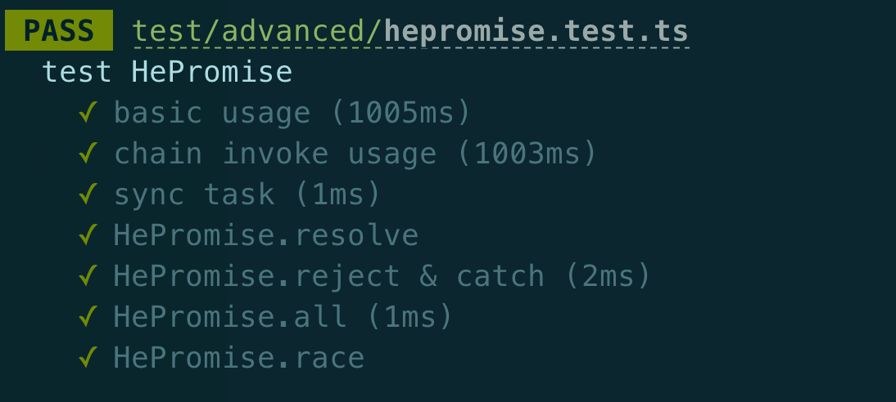

---
nav:
  title: 进阶
order: 6
title: 事件系统浅析
---

## 背景

众所周知，JavaScript 是单线程执行，这就好比是我们指责一个人做事“脑子一根筋”，这种状态是不容任何人任何事物中断执行的，然而在计算机的世界，通常我们为了资源充分利用，引入了资源抢占的概念。多线程语言可以比较轻松实现线程间协同工作与通信，在 JavaScript 中想要实现“多线程”，则是通过事件系统。

## 多进程与多线程

其实，浏览器环境下，JavaScript 是单线程，但浏览器执行是多进程，浏览器的进程我们可以大致划分为以下几个：

1. 浏览器主进程
2. GPU 进程
3. 渲染进程
4. 页面 Tab 进程
5. 网络通信进程
6. 存储服务进程
7. 音视频进程
8. 拓展程序进程

图示如下：



其中，JavaScript 线程包含在渲染进程中，关于渲染进程中的线程，我们可以分为以下几个：

1. GUI 线程
2. JavaScript 执行线程
3. 事件触发线程
4. 定时触发器线程
5. 异步 http 请求线程

对应线程的职责如下：

**GUI 渲染线程**

负责渲染浏览器界面，解析 HTML、CSS、构建 DOM 树和 RenderObject 树，布局和绘制等
当界面需要重绘（Repaint）或由于某种操作导致重排（Reflow）时，该线程就会执行
GUI 渲染线程和 JS 引擎线程是互斥的，当 js 引擎执行时 GUI 线程会被挂起（相当于冻结），GUI 更新会被保存在一个队列中等到 js 引擎空闲时立即执行

**JavaScript 引擎线程**

也称之为 JS 内核，负责处理 JavaScript 脚本程序（V8 引擎）
JS 引擎线程负责解析 JavaScript 脚本，运行代码
JS 引擎一直在等待着任务的到来，然后加以处理，一个 renderer 进程中无论如何都只有一个 JS 线程在运行 JS 程序
由于 GUI 渲染线程和 JS 引擎线程是互斥的，所以如果 JS 执行时间如果过长，这样就会造成页面渲染不连贯，导致页面渲染加载阻塞

**事件触发线程**

归属于浏览器而不是 JS 引擎，用来控制事件循环
当 JS 引擎执行代码，如 setTimeout 时（也可以是来自浏览器内核的其他线程，如鼠标点击，ajax 请求等），会将对应的任务添加到事件线程当中
当对应的事件符合触发条件被触发时，事件线程会把事件添加到待处理事件队列的队尾，等待 JS 引擎的处理
由于 JS 的单线程关系，所以这些待处理队列中的事件都得排队等待 JS 引擎处理（当 JS 引擎空闲时才会去执行）

**定时器触发器线程**

setInterval 和 setTimeout 所在的线程
浏览器定时计数器并不是由 JS 引擎计数的（因为 JS 是单线程的，如果处于阻塞状态就会影响计数的准确性）
单独的线程来计时并触发定时（计时完毕后，添加到事件队列中，等待 JS 引擎空闲后执行）
W3C 在 HTML 标准中规定，规定要求 setTimeout 中低于 4ms 的时间间隔算为 4ms

**异步 http 请求线程**

在 XMLHttpRequest 在连接后通过浏览器开一个线程请求
将检测到状态变更时，如果有设置有回调函数，异步线程就产生状态变更事件，将这个回调再放入事件队列中，再有 JS 引擎执行
这里说的是主流的浏览器渲染进程的主要几个线程，但不囊括所有，如果遇到相应的问题，欢迎评论。

## 事件循环

为什么提到事件系统，我们都会有“循环”这个字眼呢？那是因为浏览器中，事件相关数据存放在一个公共区域，不同事件存放在一个队列中，当事件完成后，事件执行结果会存放到事件队列中，当浏览器执行完当前主线程任务后，会访问事件队列，如果队列不为空，则表示有事件需要进行处理。

看到这里，我们是不是联想到了上一篇文章提到的 React 调度器工作原理呢？

以上执行过程我们概述为：

1. 主线程每次执行任务时，先判断任务类型（同步/异步）

2. 根据任务类型，决定如何处理

   - 若是同步任务，则直接执行直至完成
   - 若是异步任务，则将该任务交由异步线程进行处理

3. 当异步线程处理完任务后，会将事件的回调结果放到事件队列中

4. 当主线程完成当前同步任务后，会访问事件队列存储区，检测当前是否存在待执行的事件回调，如果有，则事件队列中队首回调出队进行执行

## 宏任务与微任务

上面在介绍事件循环时，简化了异步任务类别，其实异步任务还会细分为：宏任务、微任务。其中微任务的优先等级比宏任务高，所以在主线程空闲时，会优先检查微任务队列，执行完微任务队列中的任务后，转而检查宏任务队列并执行。关于事件循环与宏微任务，我们总结一下几个重点：

1. 一个事件系统单元中，可存在多个宏任务队列，但只有一个微任务队列；
2. 每一个宏任务执行完都会重新渲染一次；
3. 微任务队列中所有任务执行完毕会重新渲染一次；
4. requestAnimationFrame 的处理机制即不存在于微任务队列，也不存在于宏任务队列中。下次页面重绘前所执行的操作，而重绘也是作为宏任务的一个步骤来存在的，且该步骤晚于微任务的执行

常见的微任务有以下几个：

- Promise
- MutationObserver

当然在 Node.js 环境中还包含 `process.nextTick`，当主线程辨识出任务为以上几个时，会交由异步线程处理，异步线程处理完成会将处理结果与回调放置到微任务队列中，待到主线程空闲时，就会优先执行微任务中的任务。

常见的宏任务有以下几个：

- script（整体代码）
- setTimeout / setInterval
- I/O 处理
- UI Rendering （requestAnimationFrame）

当然在 Node.js 环境中还包含 `setImmediate`。

有了这些储备知识，我们通过一个示例来理解事件系统的时序，代码实例如下：

```js
const $child = document.querySelector('#child');
const $parent = document.querySelector('#parent');

function handleClick() {
  // 1
  // 4
  console.log('click');

  // 2
  // 5
  Promise.resolve().then(_ => console.log('promise'));

  // 9
  // 10
  setTimeout(_ => console.log('timeout'));

  // 7
  // 8
  requestAnimationFrame(_ => console.log('animationFrame'));

  $child.setAttribute('data-num', Math.random());
}

new MutationObserver(_ => {
  // 3
  // 6
  console.log('observer');
}).observe($parent, {
  attributes: true,
});

$child.addEventListener('click', handleClick);
$parent.addEventListener('click', handleClick);
```

这个面试题非常经典，值得我们仔细推敲。首先我们有两个元素 child 和 parent，他们是父子关系，大概像这样：

```html
<div id="parent">
  <div id="child">child</div>
</div>
```

首先我们知道，既然为这两个元素绑定鼠标点击事件的监听函数，由于事件冒泡这一特性，会导致 click 处理函数执行两次，我们先看第一次的执行，是因为 child 被点击。首先同步任务直接执行，因此会先打印 `click`，然后紧接着优先执行微任务，则打印 `promise`，接下来依然优先执行微任务，所以打印 `observer`，此时 child 的事件处理完成，但是该事件会冒泡，因此紧接着执行 handle 函数，继续依次打印 `click`、`promise`、`observer`，至此所有微任务完成，接下来执行宏任务，由于 `requestAnimationFrame` 任务的特殊性，它会在微任务执行完，宏任务执行前执行，所以依次执行两次，打印 `animationFrame`，最终执行宏任务 setTimeout，打印 `timeout`。

到这里，我们还有很多疑问，比如 ajax 异步操作是属于宏任务还是微任务呢？其实我们可以大胆推测，ajax 的发起是同步的，当主线程遇到 ajax 请求任务，则会将该任务交由 http 线程进行处理，当响应结果到达前端时，其对应回调会被放入宏任务队列中，待主线程空闲时被执行。

当然还有诸如 async / await 处理是属于宏任务还是微任务呢？那我们就需要探寻其本质，async / await 本质是 promise + generator，所以其任务也就是微任务。
