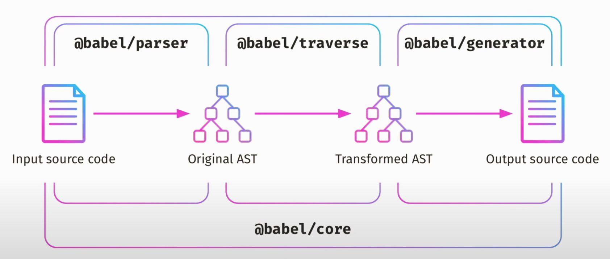
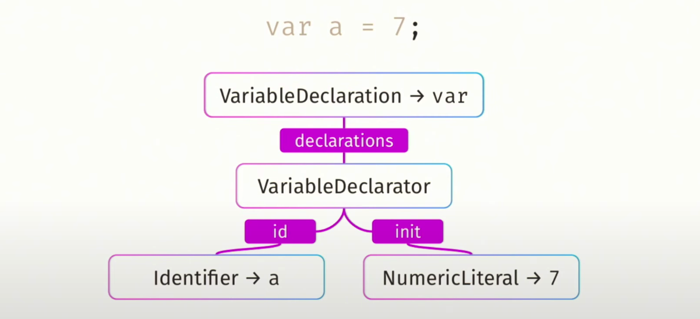
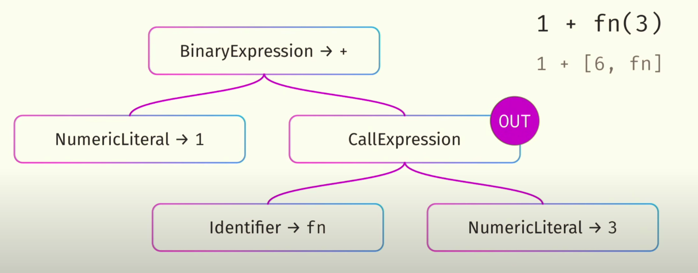
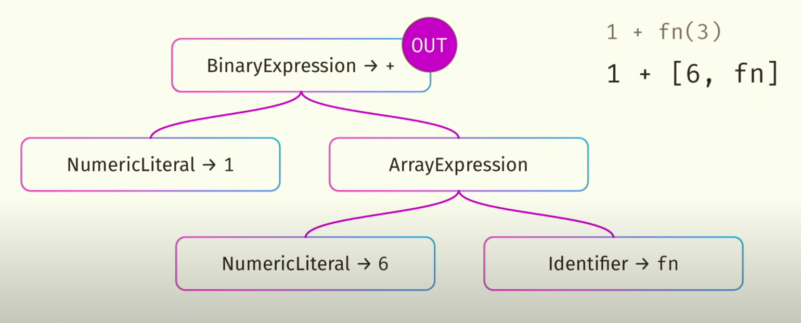

---
nav:
  title: 进阶
order: 2
title: Babel 浅析
---

## Babel 简介

Babel 是 JavaScript 编译器，更确切地说 Babel 是一个工具链，在早期，它主要用于在当前和较旧的浏览器或 js 环境中将 ECMAScript 2015+ 代码转换为 JavaScript 的向后兼容版本。而如今，通过 babel 可以做的事情远不止于此，官方文档给出了 Babel 以下特性：

- 转换语法
- 目标环境中缺少的 polyfill 功能（通过 `@babel/polyfill` ）
- 源代码转换（codemods）

除了以上特性，我们还可以借助 Babel 实现自定义编译器，实现更多场景下源代码的转换功能。例如 Taro 1.x 版本，便是使用 Babel 实现基于 Nerv 语法的多端代码转化器，虽然在后来的技术演变中，放弃了这种实现方式，但 Babel 之强大，无可厚非。本文将从 Babel 基础讲起，贯穿 Babel 链路。

日常中我们使用 Babel 最多的场景大概就是 js 代码转换了，例如 ES6 代码浏览器无法完全支持怎么办？React 应用 JSX 代码如何转换为 js 代码？这两个问题很简单，如果是借助 webpack，我们可以安装 babel-laoder 进行 js 代码处理，最终输出目标代码，不同的是，对于 ES6 代码，我们通常选择 `@babel/preset-env` 进行支持，而对于 JSX 代码，我们需要选择 `@babel/preset-react` 包以支持。

`@babel/preset-env` 可将 ES6 代码转换为兼容代码，简单示例如下：

```js
// Babel Input: ES2015 arrow function
[1, 2, 3].map(n => n + 1);

// Babel Output: ES5 equivalent
[1, 2, 3].map(function(n) {
  return n + 1;
});
```

`@babel/preset-react` 可将 JSX 代码转换为 js 代码，简单示例如下：

```js
// Babel Input: JSX
<div>123</div>;

// Babel Output: ES5 equivalent
React.createElement('div', null, '123');
```

由此可见，借助 Babel 可以轻松实现代码转换。

## Babel 工具链

Babel 转化代码内部实现可概括为：**解析源码生成 AST -> 遍历 AST 调整内容以求得到新的代码输出 -> 生成转换后的代码**。
以上介绍的三步，分别对应了 Babel 提供的三个不同包，分别为：`@babel/parser`、`@babel/traverse`、`@babel/generator` 。这个过程我们用流程图简单描述如下：



由外而内，我们从 `@babel/parser` 讲起。

### @babel/parser

介绍这个包之前，我们首先看一行很简单的代码，然后做一个简单分析。如下所示给你一段代码，请你描述这段代码。

```js
var a = 7;
```

对于 Babel，首先会分析这段代码的一些符号，这段代码中，Babel 这样来描述每个符号：

| 含义       | 符号 |
| ---------- | ---- |
| Keyword    | var  |
| Identifier | a    |
| Punctuator | =    |
| Literal    | 7    |
| Punctuator | ;    |

首先会针对代码进行词法分析（Lexical Analysis），例如以下例子，词法分析不通过：

**词法分析（Lexical Analysis）**

未结尾的注释

```js
/* var a = 7;
```

非法字符

```js
var a = 7°;
```

不正确的二进制数

```js
var a = 0b20;
```

**语法分析（Syntax Analysis）**

语法分析即是将词法分析所得内容整合到抽象语法树（AST）中。

> AST，全称 abstract syntax tree，使用对象描述语法结构。

通过词法分析，我们得到了代码中基本元素，进而需要进行语法分析，串词成句，对于上面所讲到的 `var a = 7;` 这段代码，进行语法分析后构建抽象语法树，结果如图：



**语义分析（Semantic Analysis）**

经过词法、语法分析后，代码还需结合上下文进行语义分析，例如在作用域中使用了某个不曾声明的变量，在作用域中重复声明某个变量等问题。示例代码如下：

重复声明

```js
let num = 2;
let num = 3;
```

使用不在该作用域中的变量

```js
{
  let str = 'hello';
}
console.log(str);
```

到这里，Babel Parser 已基本完成代码的解析工作，并输出初始代码 AST。进而，我们需要使用 @babel/traverse，遍历代码以生成目标代码。

以上介绍了 parser 内部流程，我们用一下示例一窥其用法：

```js
require('@babel/parser').parse('code', {
  // parse in strict mode and allow module declarations
  sourceType: 'module',

  plugins: [
    // enable jsx and flow syntax
    'jsx',
    'flow',
  ],
});
```

### @babel/traverse

看到遍历，我们很容易联想到数组的遍历，而在 AST 中，我们使用的算法是图遍历，更准确的说是 **深度优先搜索**。

**声明遍历（Declarative traversal）**
拿到 parser 转化得到的 AST 后，通过遍历以对不同声明进行操作，示例如下：

```js
traverse(ast, {
  CallExpression: {
    enter() {
      console.log('Call');
    },
  },
});
```

**动态抽象语法树（Dynamic Abstract Syntax Tree）**
抽象语法树可能会在遍历过程中，动态调整部分结构，如下例所示：

遍历到 1 + fn(3) 时，使用 [6, fn] 替换该表达式，CallExpression 替换为 ArrayExpression

遍历完后，返回


**作用域分析（Scope analysis）**

以上过程完成了 Babel 抽象语法树遍历过程，并根据实际需求，将初始代码 AST 在遍历过程转换成了目标代码 AST ，接下来需要将目标代码 AST 输出为目标代码。

以上介绍了 traverse 内部流程，我们用一下示例一窥其用法：

```js
import * as parser from '@babel/parser';
import traverse from '@babel/traverse';

const code = `function square(n) {
  return n * n;
}`;

const ast = parser.parse(code);

traverse(ast, {
  enter(path) {
    if (path.isIdentifier({ name: 'n' })) {
      path.node.name = 'x';
    }
  },
});
```

### @babel/generator

将 AST 转化生成为目标代码，如下例所示：

```js
import { parse } from '@babel/parser';
import generate from '@babel/generator';

const a = 'var a = 1;';
const b = 'var b = 2;';
const astA = parse(a, { sourceFilename: 'a.js' });
const astB = parse(b, { sourceFilename: 'b.js' });
const ast = {
  type: 'Program',
  body: [].concat(astA.program.body, astB.program.body),
};

const { code, map } = generate(
  ast,
  { sourceMaps: true },
  {
    'a.js': a,
    'b.js': b,
  },
);
```

### @babel/types、@babel/template

**@babel/types**

使用 `@babel/types` 包可以很轻松进行语法树中节点的类型判断等操作，例如，我们可以用以下方式判断一个节点是表达式：

```js
t.isExpression(node);
```

或者可以使用以下方式判断，某个节点是否为 test 为名的标识符。

```js
t.isIdentifier(node, { name: 'test' });
```

与此同时，使用 `@babel/types` 可以很轻松构建一个表达式，例如期望将 varId 节点的值增加 2。可以这样使用：

```js
t.assignmentExpression('+=', varId, t.numericLiteral(2));
```

转换后，得到如下 AST：

```js
{
  type: 'AssignmentExpression',
  operator: '+=',
  right: varId,
  left: {
    type: 'NumericLiteral',
    value: 2
  }
}
```

接下来，我们看看更为复杂的 AST 构建，需求为：给定一个描述数组的节点 varId，构建语法树使得该数组每个元素增加 2，且最后仅返回值大于 10 的元素。代码示例如下：

```js
t.assignmentExpression(
  '=',
  varId,
  t.callExpression(
    t.memberExpression(
      t.callExpression(t.memberExpression(varId, t.identifier('map')), [
        t.arrowFunctionExpression(
          [t.identifier('e')],
          t.binaryExpression('+', t.identifier('e'), t.numericLiteral(2)),
        ),
      ]),
      t.identifier('filter'),
    ),
    [
      t.arrowFunctionExpression(
        [t.identifier('e')],
        t.binaryExpression('>', t.identifier('e'), t.numericLiteral(10)),
      ),
    ],
  ),
);
```

以上代码着实令人头秃，很多时候，我们期望在可读性高、代码维护成本低的前提下，书写可靠代码，以上示例我们可以通过另外一种方式实现，那就是模板定义。

**@babel/template**

还是以上例为例，我们使用模板方式构建 AST 就非常方便了，代码示例如下：

```js
import template from '@babel/template';

template.expression.ast`
  ${varId} = ${varId}
              .map(e => e + 2)
              .filter(e => e > 10)
`;
```

## Babel 的启动与配置

我们最常见 Babel 的使用方式便是在 webpack 工具中，使用 babel-loader 进行 js 资源处理，Babel 的配置可以定义在 package.json 或者 项目下的 .babelrc 中。除了 babel-loader，还可以通过以下方式使用 Babel：

- @babel/cli
- @babel/register
- babelify
- parcel
- babel-loader

关于 Babel 的配置，我们可以定义在一下文件中：

- babel.config.js
- .babelrc
- package.json
- 运行时指定

## Plugin

### 常用 Plugin

Babel 给我们提供了很多实用插件，如下表：

| 类别         | 插件                                                                     |
| ------------ | ------------------------------------------------------------------------ |
| features     | @babel/plugin-transform-classes                                          |
| proposals    | @babel/plugin-proposal-optional-chaining                                 |
| extensions   | @babel/plugin-transform-typescript<br/>@babel/plugin-transform-react-jsx |
| optimization | @babel/plugin-transform-runtime                                          |

当然，Babel 插件远不止于此，如果你想了解更多 Babel 插件，可自行搜索。

### 自定义 Babel Plugin

自定义 Babel plugin 前，我们首先需要明确一下几个观点：

- Babel 插件是一个函数，函数返回一个对象，该对象中的不同属性与方法定义了 plugin 的功能
- 插件必须有一个响当当的名字
- 定义 Babel 遍历器
- 修改 Babel 配置
- 继承其他 plugin

熟悉这几点以后，我们用一个最简单的示例，演示定义一个 Babel Plugin 所需要的最基本元素，示例如下：

```js
function EnhanfePlugin(babel, options) {
  return {
    name: 'enhanfe-plugin',
    visitor: {
      CallExpression(path) {
        /*...*/
      },
    },
    manipulateOptions(babelOptions) {
      /*...*/
    },
    inherits: require('another-plugin'),
  };
}
```

掌握了开发一个 Plugin 最基本的构成后，我们通过一个示例学习 Babel Plugin 的封装。需求如下：手写转换插件，支持对象可选链取值，代码如下：

```js
person?.name;
```

根据以上 Plugin 定义模板，我们分块编写逻辑，代码与各部分说明如下代码片段所示：

```js
module.exports = function EnhanfePlugin(babel, options) {
  const { types: t, template } = babel;
  return {
    name: 'enhanfe-plugin',
    manipulateOptions(opts) {
      opts.parserOpts.plugin.push('optionalChanning');
    },
    visitor: {
      OptionalMemeberExpression(path) {
        const { object, property } = path.node;

        // 重新构建表达式
        const memberExpr = t.memberExpression(
          object,
          property,
          path.node.computed,
        );

        // 需要处理 undefined 以防止 undefined 作为变量名被赋值
        // 通过 path 获取到当前作用域，并构建一个 undefined 节点
        const relUndefined = path.scope.buildUndefinedNode();

        path.replaceWith(template.expression.ast`
          ${object} == null ? ${relUndefined} : ${memberExpr}
        `);
      },
    },
  };
};
```

以上插件定义对于给定的测试用例，已经可以满足了，但是如果改变可选链长度或者调用形式，以上 Plugin 将无法使用，比如以下场景的取值：

```js
bags?.[0];
person?.children?.[0]?.name;
```

为了支持以上用例，我们需要编写更复杂逻辑处理，覆盖尽可能多的测试用例。示例代码如下：

```js
module.exports = function EnhanfePlugin(babel, options) {
  const { types: t, template } = babel;
  return {
    name: 'enhanfe-plugin',
    manipulateOptions(opts) {
      opts.parserOpts.plugin.push('optionalChanning');
    },
    visitor: {
      OptionalMemeberExpression(path) {
        // 暂存
        const originalPath = path;

        const temp = path.scope.generateUidIdentifier('obj');
        path.scope.push({ id: temp });

        // 如果当前节点存在可选链表示
        while (!path.node.optional) {
          path = path.get('object');
        }

        let memberExpr = temp;

        do {
          memberExpr = t.memberExpression(
            memberExpr,
            path.node.property,
            path.node.computed,
          );

          // 遍历完成，跳出循环
          if (path === originalPath) break;
          path = path.parentPath;
        } while (true);

        // 需要处理 undefined 以防止 undefined 作为变量名被赋值
        // 通过 path 获取到当前作用域，并构建一个 undefined 节点
        const relUndefined = path.scope.buildUndefinedNode();

        path.replaceWith(template.expression.ast`
          ${object} == null ? ${relUndefined} : ${memberExpr}
        `);
      },
    },
  };
};
```

从上例中，我们可以看出 path 遍历是自底向上的，这也说明了对象链式调用的向前推断这一特性。通过以上开发的简单 Babel 插件，Babel 便能支持可选链这一语法，这时你只需要在使用 Babel 的地方引入该插件即可，以 webpack 中 babel-loader 为例，配置 Babel 插件方式如下：

```js
// .babelrc

{
  "plugins": [
    "myPlugin",
    "babel-plugin-myPlugin" // equivalent
  ]
}
```

Babel 能做的事情还有很多，我们只需要通过定义 Plugin、Preset 即可借助 Babel 完成代码转换、语法兼容、拓展语言特性等功能。如果你意犹未尽，可以查看 Taro 1.x 源码，核心实现逻辑便是借助 Babel 以完成多端应用编译。

最后，感谢 Nicolò 大佬分享，文中图片与部分观点借鉴自这位前辈。
