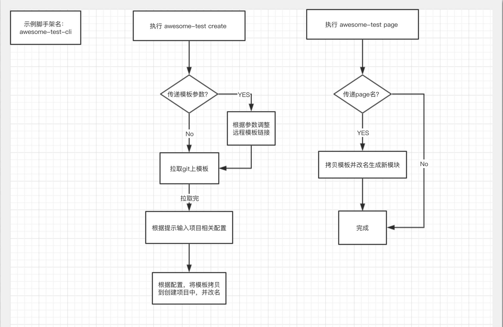
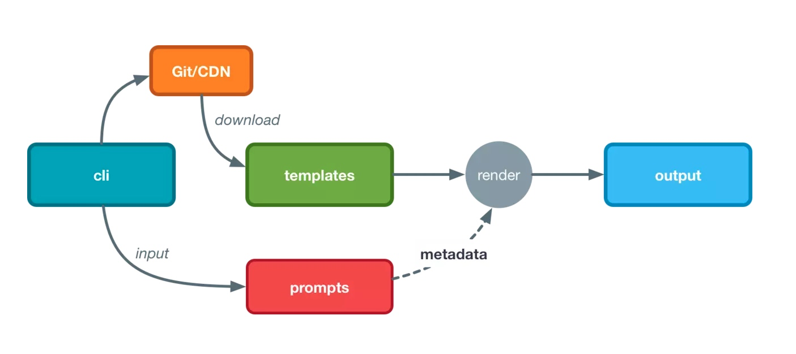
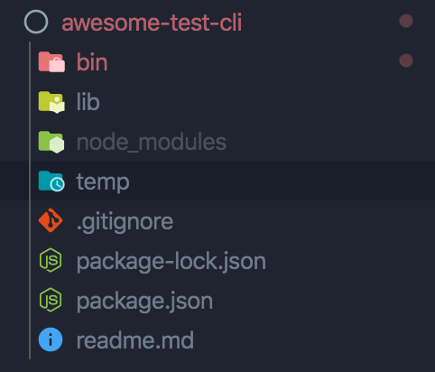

---
nav:
  title: 进阶
order: 3
title: 前端项目脚手架开发实践
---

## 项目背景

相信大家在工作中都有如下经历：

1. 开发新项目，很多逻辑比如：项目架构、接口请求、状态管理、国际化、换肤等之前项目就已经存在，这时，我们选择“信手拈来”，ctrl + c，ctrl + v 二连，谈笑间，新项目搭建完成，无非是要改改一些文件和包名；
2. 项目增加某个模块时，复制一个已有模块，改改名字，新的模块就算创建成功了；
3. 项目的规范要无时无刻不在同事耳边提及，就算有规范文档，你还需要苦口婆心。

使用复制粘贴有以下缺点：

1. 重复性工作，繁琐而且浪费时间
2. copy 过来的模板容易存在无关的代码
3. 项目中有很多需要配置的地方，容易忽略一些配置点
4. 人工操作永远都有可能犯错，建新项目时，总要花时间去排错
5. 框架也会不断迭代，人工建项目不知道最新版本号是多少，使用的依赖都是什么版本，很容易 bug 一大堆。

承受过以上一些痛苦的同学应该不少，怎么去解决这些问题呢？我觉得，脚手架能够规避很多认为操作的问题，因为脚手架能够根据你事先约定的规范，创建项目，定义新的模块，打包，部署等等都能够在一个命令敲击后搞定，提升效率的同时降低了入职员工的培训成本，所以，我推荐大家考虑考虑为团队打造一个脚手架！

## 脚手架所需依赖

| 库名              | 描述             |
| ----------------- | ---------------- |
| commander         | 处理控制台命令   |
| chalk             | 五彩斑斓的控制台 |
| semver            | 版本检测提示     |
| fs-extra          | 更友好的 fs 操作 |
| inquirer          | 控制台询问       |
| execa             | 执行终端命令     |
| download-git-repo | git 远程仓库拉取 |

## 脚手架的职责和执行过程

脚手架可以为我们做很多事情，比如项目的创建、项目模块的新增、项目打包、项目统一测试、项目发布等，我先与大家聊聊最初始的功能，项目创建：



上图向大家展示了创建项目和项目中创建模块的脚手架大致工作流程，下图更详细描述了基于模板创建的过程：



其实思路比较简单，当我们运行脚手架命令时，命令行会给出相关创建命令提示，我们只需要根据相关提示输入对应内容即可，项目相关信息键入完成后，脚手架会从远程仓库（这里的仓库可以是 github、gitlab 等）拉取模板资源，然后将模板中的内容替换，输出到新的文件夹中完成项目创建工作。

## package.json 与入口

项目结构如图



在 package.json 中指明你的包通过怎样软链接的形式启动：`bin` 指定，因为是 package.json 包，我们需要注意 dependencies、devDependencies 和 peerDependencies 的区别。

```json
{
  "name": "awesome-test-cli",
  "version": "1.0.0",
  "description": "前端脚手架工具",
  "main": "index.js",
  "bin": {
    "awesome-test": "bin/main.js"
  },
  "scripts": {
    "test": "echo \"Error: no test specified\" && exit 1"
  },
  "keywords": ["scaffold", "efficient", "react"],
  "author": "walker",
  "license": "ISC",
  "engines": {
    "node": ">=8.9"
  },
  "dependencies": {
    "chalk": "^2.4.2",
    "commander": "^3.0.0",
    "download-git-repo": "^2.0.0",
    "execa": "^2.0.4",
    "fs-extra": "^8.1.0",
    "import-global": "^0.1.0",
    "inquirer": "^6.5.1",
    "lru-cache": "^5.1.1",
    "minimist": "^1.2.0",
    "nunjucks": "^3.2.0",
    "ora": "^3.4.0",
    "request-promise-native": "^1.0.7",
    "semver": "^6.3.0",
    "string.prototype.padstart": "^3.0.0",
    "valid-filename": "^3.1.0",
    "validate-npm-package-name": "^3.0.0"
  }
}
```

定义好项目 package.json 文件后，安装相关依赖，就可以开始编写脚手架工程代码了。

我们首先编写脚手架入口文件，也就是 `/bin/main.js` ，该文件中定义的内容主要操作是通过 `commander` 处理控制台命令，解析参数，并根据不同参数处理不同的逻辑.

```js
// 开始处理命令
const program = require('commander');
const minimist = require('minimist');

program.version(require('../package').version).usage('<command> [options]');

// 创建命令
program
  .command('create <app-name>')
  .description('create a new project')
  .option(
    '-p, --preset <presetName>',
    'Skip prompts and use saved or remote preset',
  )
  .option('-d, --default', 'Skip prompts and use default preset')
  .action((name, cmd) => {
    const options = cleanArgs(cmd);
    if (minimist(process.argv.slice(3))._.length > 1) {
      console.log(
        chalk.yellow(
          '\n ⚠️  检测到您输入了多个名称，将以第一个参数为项目名，舍弃后续参数哦',
        ),
      );
    }
    require('../lib/create')(name, options);
  });
```

## create 创建项目命令

通常我们习惯将包项目逻辑相关处理放在 `lib` 中，这样一来，我们后面希望添加更多命令或操作更友好。接下来我们编写 `lib/create` 文件，该文件主要处理文件名合法检测，文件是否存在等配置，检测无误，执行项目创建逻辑，该逻辑我们放在 `lib/Creator` 文件中处理。

```js
async function create(projectName, options) {
  const cwd = options.cwd || process.cwd();
  // 是否在当前目录
  const inCurrent = projectName === '.';
  const name = inCurrent ? path.relative('../', cwd) : projectName;
  const targetDir = path.resolve(cwd, projectName || '.');

  const result = validatePackageName(name);
  // 如果所输入的不是合法npm包名，则退出
  if (!result.validForNewPackages) {
    console.error(chalk.red(`不合法的项目名: "${name}"`));
    result.errors &&
      result.errors.forEach(err => {
        console.error(chalk.red.dim('❌ ' + err));
      });
    result.warnings &&
      result.warnings.forEach(warn => {
        console.error(chalk.red.dim('⚠️ ' + warn));
      });
    exit(1);
  }

  // 检查文件夹是否存在
  if (fs.existsSync(targetDir)) {
    if (options.force) {
      await fs.remove(targetDir);
    } else {
      await clearConsole();
      if (inCurrent) {
        const { ok } = await inquirer.prompt([
          {
            name: 'ok',
            type: 'confirm',
            message: `Generate project in current directory?`,
          },
        ]);
        if (!ok) {
          return;
        }
      } else {
        const { action } = await inquirer.prompt([
          {
            name: 'action',
            type: 'list',
            message: `目标文件夹 ${chalk.cyan(targetDir)} 已经存在，请选择：`,
            choices: [
              { name: '覆盖', value: 'overwrite' },
              { name: '取消', value: false },
            ],
          },
        ]);
        if (!action) {
          return;
        } else if (action === 'overwrite') {
          console.log(`\nRemoving ${chalk.cyan(targetDir)}...`);
          await fs.remove(targetDir);
        }
      }
    }
  }
  await clearConsole();

  // 前面完成准备工作，正式开始创建项目
  const creator = new Creator(name, targetDir);
  await creator.create(options);
}

module.exports = (...args) => {
  return create(...args).catch(err => {
    stopSpinner(false);
    error(err);
  });
};
```

通过以上操作，完成了创建项目前的准备工作，接下来正式进行创建，创建操作通过一下代码开始

```js
const creator = new Creator(name, targetDir);
await creator.create(options);
```

创建逻辑我们放在另外文件中 `/lib/Creator`，该文件中我们主要进行的操作有：

- 拉取远程模板；
- 询问项目创建相关配置，比如：项目名、项目版本、操作人等；
- 将拉取的模板文件拷贝到创建项目文件夹中，生成 readme 文档；
- 安装项目所需依赖；
- 创建 git 仓库，完成项目创建。

```js
const chalk = require('chalk');
const execa = require('execa');
const inquirer = require('inquirer');
const EventEmitter = require('events');
const loadRemotePreset = require('../lib/utils/loadRemotePreset');
const writeFileTree = require('../lib/utils/writeFileTree');
const copyFile = require('../lib/utils/copyFile');
const generateReadme = require('../lib/utils/generateReadme');
const { installDeps } = require('../lib/utils/installDeps');

const { defaults } = require('../lib/options');

const {
  log,
  error,
  hasYarn,
  hasGit,
  hasProjectGit,
  logWithSpinner,
  clearConsole,
  stopSpinner,
  exit,
} = require('../lib/utils/common');

module.exports = class Creator extends EventEmitter {
  constructor(name, context) {
    super();

    this.name = name;
    this.context = context;

    this.run = this.run.bind(this);
  }

  async create(cliOptions = {}, preset = null) {
    const { run, name, context } = this;

    if (cliOptions.preset) {
      // awesome-test create foo --preset mobx
      preset = await this.resolvePreset(cliOptions.preset, cliOptions.clone);
    } else {
      preset = await this.resolvePreset(
        defaults.presets.default,
        cliOptions.clone,
      );
    }

    await clearConsole();
    log(
      chalk.blue.bold(
        `Awesome-test CLI v${require('../package.json').version}`,
      ),
    );
    logWithSpinner(`✨`, `正在创建项目 ${chalk.yellow(context)}.`);
    this.emit('creation', { event: 'creating' });

    stopSpinner();
    // 设置文件名，版本号等
    const { pkgVers, pkgDes } = await inquirer.prompt([
      {
        name: 'pkgVers',
        message: `请输入项目版本号`,
        default: '1.0.0',
      },
      {
        name: 'pkgDes',
        message: `请输入项目简介`,
        default: 'project created by awesome-test-cli',
      },
    ]);

    // 将下载的临时文件拷贝到项目中
    const pkgJson = await copyFile(preset.tmpdir, preset.targetDir);

    const pkg = Object.assign(pkgJson, {
      version: pkgVers,
      description: pkgDes,
    });

    // write package.json
    log();
    logWithSpinner('📄', `生成 ${chalk.yellow('package.json')} 等模板文件`);
    await writeFileTree(context, {
      'package.json': JSON.stringify(pkg, null, 2),
    });

    // 包管理
    const packageManager =
      (hasYarn() ? 'yarn' : null) || (hasPnpm3OrLater() ? 'pnpm' : 'npm');
    await writeFileTree(context, {
      'README.md': generateReadme(pkg, packageManager),
    });

    const shouldInitGit = this.shouldInitGit(cliOptions);
    if (shouldInitGit) {
      logWithSpinner(`🗃`, `初始化Git仓库`);
      this.emit('creation', { event: 'git-init' });
      await run('git init');
    }

    // 安装依赖
    stopSpinner();
    log();
    logWithSpinner(`⚙`, `安装依赖`);
    // log(`⚙  安装依赖中，请稍等...`)

    await installDeps(context, packageManager, cliOptions.registry);

    // commit initial state
    let gitCommitFailed = false;
    if (shouldInitGit) {
      await run('git add -A');
      const msg = typeof cliOptions.git === 'string' ? cliOptions.git : 'init';
      try {
        await run('git', ['commit', '-m', msg]);
      } catch (e) {
        gitCommitFailed = true;
      }
    }

    // log instructions
    stopSpinner();
    log();
    log(`🎉  项目创建成功 ${chalk.yellow(name)}.`);
    if (!cliOptions.skipGetStarted) {
      log(
        `👉  请按如下命令，开始愉快开发吧！\n\n` +
          (this.context === process.cwd()
            ? ``
            : chalk.cyan(` ${chalk.gray('$')} cd ${name}\n`)) +
          chalk.cyan(
            ` ${chalk.gray('$')} ${
              packageManager === 'yarn'
                ? 'yarn start'
                : packageManager === 'pnpm'
                ? 'pnpm run start'
                : 'npm start'
            }`,
          ),
      );
    }
    log();
    this.emit('creation', { event: 'done' });

    if (gitCommitFailed) {
      warn(
        `因您的git username或email配置不正确，无法为您初始化git commit，\n` +
          `请稍后自行git commit。\n`,
      );
    }
  }

  async resolvePreset(name, clone) {
    let preset;
    logWithSpinner(`Fetching remote preset ${chalk.cyan(name)}...`);
    this.emit('creation', { event: 'fetch-remote-preset' });
    try {
      preset = await loadRemotePreset(name, this.context, clone);
      stopSpinner();
    } catch (e) {
      stopSpinner();
      error(`Failed fetching remote preset ${chalk.cyan(name)}:`);
      throw e;
    }

    // 默认使用default参数
    if (name === 'default' && !preset) {
      preset = defaults.presets.default;
    }
    if (!preset) {
      error(`preset "${name}" not found.`);
      exit(1);
    }
    return preset;
  }

  run(command, args) {
    if (!args) {
      [command, ...args] = command.split(/\s+/);
    }
    return execa(command, args, { cwd: this.context });
  }

  shouldInitGit(cliOptions) {
    if (!hasGit()) {
      return false;
    }
    // --git
    if (cliOptions.forceGit) {
      return true;
    }
    // --no-git
    if (cliOptions.git === false || cliOptions.git === 'false') {
      return false;
    }
    // default: true unless already in a git repo
    return !hasProjectGit(this.context);
  }
};
```

到这里，我们完成了项目的创建，接下来我们一起看看项目的模块创建。

## page 创建模块

我们回到入口文件，添加 page 命令的处理

```js
// 创建页面命令
program
  .command('page <page-name>')
  .description('create a new page')
  .option('-f, --force', 'Overwrite target directory if it exists')
  .action((name, cmd) => {
    const options = cleanArgs(cmd);
    require('../lib/page')(name, options);
  });
```

与 create 类似，我们真正的逻辑处理放置在 `lib/page` 中，page 中主要负责的内容和 create 类似，为创建模块做一些准备，比如检测项目中改模块是否已经存在，如果存在，询问是否覆盖等操作。

```js
const fs = require('fs-extra');
const path = require('path');
const chalk = require('chalk');
const inquirer = require('inquirer');
const PageCreator = require('./PageCreator');
const validFileName = require('valid-filename');
const {
  error,
  stopSpinner,
  exit,
  clearConsole,
} = require('../lib/utils/common');

/**
 * 创建项目
 * @param {*} pageName
 * @param {*} options
 */
async function create(pageName, options) {
  // 检测文件名是否合规
  const result = validFileName(pageName);
  // 如果所输入的不是合法npm包名，则退出
  if (!result) {
    console.error(chalk.red(`不合法的文件名: "${pageName}"`));
    exit(1);
  }

  const cwd = options.cwd || process.cwd();
  const pagePath = path.resolve(
    cwd,
    './src/pages',
    pageName.charAt(0).toUpperCase() + pageName.slice(1).toLowerCase(),
  );
  const pkgJsonFile = path.resolve(cwd, 'package.json');

  // 如果不存在package.json，说明不再根目录，不能创建
  if (!fs.existsSync(pkgJsonFile)) {
    console.error(
      chalk.red('\n' + '⚠️  请确认您是否在项目根目录下运行此命令\n'),
    );
    return;
  }

  // 如果page已经存在，询问覆盖还是取消
  if (fs.existsSync(pagePath)) {
    if (options.force) {
      await fs.remove(pagePath);
    } else {
      await clearConsole();
      const { action } = await inquirer.prompt([
        {
          name: 'action',
          type: 'list',
          message: `已存在 ${chalk.cyan(pageName)} 页面，请选择：`,
          choices: [
            { name: '覆盖', value: true },
            { name: '取消', value: false },
          ],
        },
      ]);
      if (!action) {
        return;
      } else {
        console.log(`\nRemoving ${chalk.cyan(pagePath)}...`);
        await fs.remove(pagePath);
      }
    }
  }

  // 前面完成准备工作，正式开始创建页面
  const pageCreator = new PageCreator(pageName, pagePath);
  await pageCreator.create(options);
}

module.exports = (...args) => {
  return create(...args).catch(err => {
    stopSpinner(false);
    error(err);
  });
};
```

检测完以后，通过以下代码，执行 page 创建的逻辑

```js
// 前面完成准备工作，正式开始创建页面
const pageCreator = new PageCreator(pageName, pagePath);
await pageCreator.create(options);
```

在 `lib/pageCreator` 文件中，我们通过读取预先定义好的模板文件，生成目标文件，在这里使用了一个模板语言——nunjucks，我们将生成页面的操作放置在 `utils/generatePage` 文件中处理，如下：

```js
const chalk = require('chalk');
const path = require('path');
const fs = require('fs-extra');
const nunjucks = require('nunjucks');

const { log, error, logWithSpinner, stopSpinner } = require('./common');

const tempPath = path.resolve(__dirname, '../../temp');
const pageTempPath = path.resolve(tempPath, 'page.js');
const lessTempPath = path.resolve(tempPath, 'page.less');
const ioTempPath = path.resolve(tempPath, 'io.js');
const storeTempPath = path.resolve(tempPath, 'store.js');

async function generatePage(context, { lowerName, upperName }) {
  logWithSpinner(`生成 ${chalk.yellow(`${upperName}/${upperName}.js`)}`);
  const ioTemp = await fs.readFile(pageTempPath);
  const ioContent = nunjucks.renderString(ioTemp.toString(), {
    lowerName,
    upperName,
  });
  await fs.writeFile(path.resolve(context, `./${upperName}.js`), ioContent, {
    flag: 'a',
  });
  stopSpinner();
}

async function generateLess(context, { lowerName, upperName }) {
  logWithSpinner(`生成 ${chalk.yellow(`${upperName}/${upperName}.less`)}`);
  const ioTemp = await fs.readFile(lessTempPath);
  const ioContent = nunjucks.renderString(ioTemp.toString(), {
    lowerName,
    upperName,
  });
  await fs.writeFile(path.resolve(context, `./${upperName}.less`), ioContent, {
    flag: 'a',
  });
  stopSpinner();
}

async function generateIo(context, { lowerName, upperName }) {
  logWithSpinner(`生成 ${chalk.yellow(`${upperName}/io.js`)}`);
  const ioTemp = await fs.readFile(ioTempPath);
  const ioContent = nunjucks.renderString(ioTemp.toString(), {
    lowerName,
    upperName,
  });
  await fs.writeFile(path.resolve(context, `./io.js`), ioContent, {
    flag: 'a',
  });
  stopSpinner();
}

async function generateStore(context, { lowerName, upperName }) {
  logWithSpinner(`生成 ${chalk.yellow(`${upperName}/store-${lowerName}.js`)}`);
  const ioTemp = await fs.readFile(storeTempPath);
  const ioContent = nunjucks.renderString(ioTemp.toString(), {
    lowerName,
    upperName,
  });
  await fs.writeFile(
    path.resolve(context, `./store-${lowerName}.js`),
    ioContent,
    { flag: 'a' },
  );
  stopSpinner();
}

module.exports = (context, nameObj) => {
  Promise.all([
    generateIo(context, nameObj),
    generatePage(context, nameObj),
    generateStore(context, nameObj),
    generateLess(context, nameObj),
  ]).catch(err => {
    stopSpinner(false);
    error(err);
  });
};
```

在 PageCreator 中引入该文件，并执行，给一些提示，会更友好。

```js
const chalk = require('chalk');
const EventEmitter = require('events');
const fs = require('fs-extra');

const generatePage = require('./utils/generatePage');

const {
  log,
  error,
  logWithSpinner,
  clearConsole,
  stopSpinner,
  exit,
} = require('../lib/utils/common');

module.exports = class PageCreator extends EventEmitter {
  constructor(name, context) {
    super();

    this.name = name;
    this.context = context;
  }

  async create(cliOptions = {}) {
    const fileNameObj = this.getName();
    const { context } = this;
    await clearConsole();
    log(
      chalk.blue.bold(
        `Awesome-test CLI v${require('../package.json').version}`,
      ),
    );
    logWithSpinner(`✨`, `正在创建页面...`);
    // 创建文件夹
    await fs.mkdir(context, { recursive: true });
    this.emit('creation', { event: 'creating' });

    stopSpinner();

    console.log(context);
    await generatePage(context, fileNameObj);
  }

  getName() {
    const originName = this.name;
    const tailName = originName.slice(1);
    const upperName = originName.charAt(0).toUpperCase() + tailName;
    const lowerName = originName.charAt(0).toLowerCase() + tailName;
    return {
      upperName,
      lowerName,
    };
  }
};
```

到这里我们完成了脚手架的项目创建和模块创建，相信此时的你也迫不及待了，你可以顺着这个思路，走下去，为脚手架赋予更多能力！

项目源码：[https://github.com/HeyiMaster/awesome-test-cli](https://github.com/HeyiMaster/awesome-test-cli)
