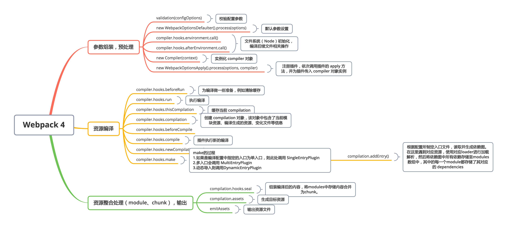

---
nav:
  title: 🔥 进阶
order: 1
title: Tapable 与 Webpack 浅析
---

## Tapable 简介

Tapable 插件机制实现了 Webpack 强大的扩展功能，重构后的 Taro ，也使用了 Tapable 以实现插件机制。其实，Tapable 是事件机制实现方案，Webpack 中负责编译工作的 Compiler 和负责创建生成资源的 Compilation 都是基于 Tapable 实现。

Tapable 提供了很多钩子来定义事件流，这些钩子均被命名为 Hook，其中常用 Hook 示例如下：

```js
const {
  SyncHook,
  SyncBailHook,
  SyncWaterfallHook,
  SyncLoopHook,
  AsyncParallelHook,
  AsyncParallelBailHook,
  AsyncSeriesHook,
  AsyncSeriesBailHook,
  AsyncSeriesWaterfallHook,
} = require('tapable');
```

以上所示所有 Hook 构造函数都接收一个可选参数，该参数是一个由字符串参数组成的数组，简单示例如下：

```js
const myhook = new SyncHook(['arg1', 'arg2', 'arg3']);
```

定义好的 hook 可通过对应方法（call/callAsync）去调用执行。
介绍各个 Hook 之前，我们先介绍下各自 Hook 的使用场景以及概念。

## Hook 概览

Hook 大致分为两大类，一类是同步的，另一类是异步的，其中异步 Hook 又分为并发执行和串行执行。各 Hook 使用场景与概念如下表所示：

<style>
table th:nth-of-type(2) {
    width: 60px;
}
</style>

| Hook 名                  | 执行方式 | 使用要点                                                                                                                               |
| ------------------------ | -------- | -------------------------------------------------------------------------------------------------------------------------------------- |
| SyncHook                 | 同步串行 | 不关心该 hook 示例订阅函数的返回值                                                                                                     |
| SyncHook                 | 同步串行 | 不关心监听函数的返回值                                                                                                                 |
| SyncBailHook             | 同步串行 | 只要监听函数中有一个函数的返回值不为 null，则跳过剩下所有的逻辑                                                                        |
| SyncWaterfallHook        | 同步串行 | 上一个监听函数的返回值可以传给下一个监听函数                                                                                           |
| SyncLoopHook             | 同步循环 | 当监听函数被触发的时候，如果该监听函数返回 true 时则这个监听函数会反复执行，如果返回 undefined 则表示退出循环                          |
| AsyncParallelHook        | 异步并发 | 不关心监听函数的返回值                                                                                                                 |
| AsyncParallelBailHook    | 异步并发 | 只要监听函数的返回值不为 null，就会忽略后面的监听函数执行，直接跳跃到 callAsync 等触发函数绑定的回调函数，然后执行这个被绑定的回调函数 |
| AsyncSeriesHook          | 异步串行 | 不用关心 callback 函数的参数                                                                                                           |
| AsyncSeriesBailHook      | 异步串行 | callback 函数的参数不为 null，就会直接执行 callAsync 等触发函数绑定的回调函数                                                          |
| AsyncSeriesWaterfallHook | 异步串行 | 上一个监听函数的中的 callback(err, data)的第二个参数,可以作为下一个监听函数的参数                                                      |

对于不同场景，选择不用 Hook 实现，接下来我们学习关于各 Hook 的详细内容。

Hook 分为同步与异步、串行与并行，下面我们以这些类别展开。

## Hook 使用示例

### SyncHook

该 Hook 是 Tapable 中最常见最基础的 Hook，它不关心监听函数的返回值。使用示例如下：

**使用示例**

```js
const { SyncHook } = require('tapable');
let queue = new SyncHook(['name']);

// 订阅
queue.tap('1', function(name, name2) {
  // tap 的第一个参数是用来标识订阅的函数的
  console.log(name, name2, 1);
  return '1';
});
queue.tap('2', function(name) {
  console.log(name, 2);
});
queue.tap('3', function(name) {
  console.log(name, 3);
});

// 发布
queue.call('webpack', 'webpack-cli'); // 发布的时候触发订阅的函数 同时传入参数
```

以上执行结果如下所示：

```js
webpack undefined 1
webpack 2
webpack 3
```

> Hook 构造函数都接收一个可选的参数，该参数是一个字符串数组。

**实现原理**

该 Hook 的实现原理较为简单，就是发布订阅模式，hook 示例通过 tap 方法注册事件，通过 call 方法调用已注册的事件。代码示例如下：

```js
class SyncHook {
  constructor() {
    this.hooks = [];
  }

  // 订阅
  tap(name, fn) {
    this.hooks.push(fn);
  }

  // 发布
  call() {
    this.hooks.forEach(hook => hook(...arguments));
  }
}
```

### SyncBailHook

在给定的事件处理函数中，只要某一个监听函数返回值不为 null，则跳过剩下所有处理函数。

**使用示例**

```js
const { SyncBailHook } = require('tapable');

let queue = new SyncBailHook(['name']);

queue.tap('1', function(name) {
  console.log(name, 1);
});
queue.tap('2', function(name) {
  console.log(name, 2);
  return 'wrong';
});
queue.tap('3', function(name) {
  console.log(name, 3);
});

queue.call('webpack');
```

执行结果如下：

```
webpack 1
webpack 2
```

**实现原理**

在遍历所有事件处理函数时，如果 hook 函数执行后存在返回值，则跳过后面的所有 hook。

```js
class SyncBailHook {
  constructor() {
    this.hooks = [];
  }

  // 订阅
  tap(name, fn) {
    this.hooks.push(fn);
  }

  // 发布
  call() {
    for (let i = 0, l = this.hooks.length; i < l; i++) {
      let hook = this.hooks[i];
      let result = hook(...arguments);
      if (result) {
        break;
      }
    }
  }
}
```

### SyncWaterfallHook

该 Hook 可将上一个处理函数的返回值传递给下一个处理函数函数，以此实现 hook 间参数的传递。

**使用示例**

```js
const { SyncWaterfallHook } = require('tapable');

let queue = new SyncWaterfallHook(['name']);

// 上一个函数的返回值可以传给下一个函数
queue.tap('1', function(name) {
  console.log(name, 1);
  return 1;
});
queue.tap('2', function(data) {
  console.log(data, 2);
  return 2;
});
queue.tap('3', function(data) {
  console.log(data, 3);
});

queue.call('webpack');
```

执行结果如下：

```
webpack 1
1 2
2 3
```

**实现原理**

```js
class SyncWaterfallHook {
  constructor() {
    this.hooks = [];
  }

  // 订阅
  tap(name, fn) {
    this.hooks.push(fn);
  }

  // 发布
  call() {
    let result = null;
    for (let i = 0, l = this.hooks.length; i < l; i++) {
      let hook = this.hooks[i];
      result = i == 0 ? hook(...arguments) : hook(result);
    }
  }
}
```

### SyncLoopHook

当监听函数被触发的时候，如果该监听函数返回 true 则这个监听函数会反复执行，知道返回 undefined 退出循环。

**使用示例**

```js
const { SyncLoopHook } = require('tapable');

let queue = new SyncLoopHook(['name']);

let count = 3;
queue.tap('1', function(name) {
  console.log('count: ', count--);
  if (count > 0) {
    return true;
  }
  return;
});

queue.call('webpack');
```

以上执行结果如下所示:

```
count: 3
count: 2
count: 1
```

**实现原理**

```js
class SyncLoopHook {
  constructor() {
    this.hook = null;
  }

  // 订阅
  tap(name, fn) {
    this.hook = fn;
  }

  // 发布
  call() {
    let result;
    do {
      result = this.hook(...arguments);
    } while (result === true);
  }
}
```

### AsyncParallelHook

该 Hook 不关心监听函数的返回值。与此同时，可以用一下方式进行事件注册和调用，分别为：<br/>

订阅 vs 调用：<br/>
tap vs callAsync<br/>
tapAsync vs callAsync<br/>
tapPromise vs promise<br/>

**使用示例-tap**

```js
const { AsyncParallelHook } = require('tapable');

let queue1 = new AsyncParallelHook(['name']);
console.time('cost');
queue1.tap('1', function(name) {
  console.log(name, 1);
});
queue1.tap('2', function(name) {
  console.log(name, 2);
});
queue1.tap('3', function(name) {
  console.log(name, 3);
});
queue1.callAsync('webpack', err => {
  console.timeEnd('cost');
});
```

以上示例执行结果如下所示：

```js
webpack 1
webpack 2
webpack 3
cost： 3.792ms
```

**使用示例-tapAsync**

```js
let queue2 = new AsyncParallelHook(['name']);
console.time('cost1');
queue2.tapAsync('1', function(name, cb) {
  setTimeout(() => {
    console.log(name, 1);
    cb();
  }, 1000);
});
queue2.tapAsync('2', function(name, cb) {
  setTimeout(() => {
    console.log(name, 2);
    cb();
  }, 2000);
});
queue2.tapAsync('3', function(name, cb) {
  setTimeout(() => {
    console.log(name, 3);
    cb();
  }, 3000);
});

queue2.callAsync('webpack', () => {
  console.log('over');
  console.timeEnd('cost');
});
```

以上示例执行结果如下：

```js
webpack 1
webpack 2
webpack 3
over
cost： 4.021ms
```

**使用示例-promise**

```js
let queue3 = new AsyncParallelHook(['name']);
console.time('cost3');
queue3.tapPromise('1', function(name, cb) {
  return new Promise(function(resolve, reject) {
    setTimeout(() => {
      console.log(name, 1);
      resolve();
    }, 1000);
  });
});

queue3.tapPromise('1', function(name, cb) {
  return new Promise(function(resolve, reject) {
    setTimeout(() => {
      console.log(name, 2);
      resolve();
    }, 2000);
  });
});

queue3.tapPromise('1', function(name, cb) {
  return new Promise(function(resolve, reject) {
    setTimeout(() => {
      console.log(name, 3);
      resolve();
    }, 3000);
  });
});

queue3.promise('webpack').then(
  () => {
    console.log('over');
    console.timeEnd('cost3');
  },
  () => {
    console.log('error');
    console.timeEnd('cost3');
  },
);
```

以上示例执行结果如下：

```js
webpack 1
webpack 2
webpack 3
over
cost3：3010.932ms
```

### AsyncParallelBailHook

只要监听函数的返回值不为 null，就会忽略后面的监听函数执行，直接跳跃到 callAsync 等触发函数绑定的回调函数，然后执行这个被绑定的回调函数。

**使用示例-tap**

```js
let queue1 = new AsyncParallelBailHook(['name']);
console.time('cost');
queue1.tap('1', function(name) {
  console.log(name, 1);
});
queue1.tap('2', function(name) {
  console.log(name, 2);
  return 'wrong';
});
queue1.tap('3', function(name) {
  console.log(name, 3);
});
queue1.callAsync('webpack', err => {
  console.timeEnd('cost');
});
```

以上示例执行结果如下：

```js
webpack 1
webpack 2
cost： 3.179ms
```

**使用示例-tapAsync**

```js
let queue2 = new AsyncParallelBailHook(['name']);
console.time('cost1');
queue2.tapAsync('1', function(name, cb) {
  setTimeout(() => {
    console.log(name, 1);
    cb();
  }, 1000);
});
queue2.tapAsync('2', function(name, cb) {
  setTimeout(() => {
    console.log(name, 2);
    return 'wrong'; // 最后的回调就不会调用了
    cb();
  }, 2000);
});
queue2.tapAsync('3', function(name, cb) {
  setTimeout(() => {
    console.log(name, 3);
    cb();
  }, 3000);
});

queue2.callAsync('webpack', () => {
  console.log('over');
  console.timeEnd('cost');
});
```

以上示例执行结果如下：

```js
webpack 1
webpack 2
webpack 3
over
cost： 3.579ms
```

**使用示例-promise**

```js
let queue3 = new AsyncParallelBailHook(['name']);
console.time('cost3');
queue3.tapPromise('1', function(name, cb) {
  return new Promise(function(resolve, reject) {
    setTimeout(() => {
      console.log(name, 1);
      resolve();
    }, 1000);
  });
});

queue3.tapPromise('2', function(name, cb) {
  return new Promise(function(resolve, reject) {
    setTimeout(() => {
      console.log(name, 2);
      reject('wrong'); // reject()的参数是一个不为 null 的参数时，最后的回调就不会再调用了
    }, 2000);
  });
});

queue3.tapPromise('3', function(name, cb) {
  return new Promise(function(resolve, reject) {
    setTimeout(() => {
      console.log(name, 3);
      resolve();
    }, 3000);
  });
});

queue3.promise('webpack').then(
  () => {
    console.log('over');
    console.timeEnd('cost3');
  },
  () => {
    console.log('error');
    console.timeEnd('cost3');
  },
);
```

以上示例执行结果如下：

```js
webpack 1
webpack 2
error
cost3：2010.845ms
webpack 3
```

**异步串行**

### AsyncSeriesHook

该 Hook 不关心 callback 函数参数

**使用示例-tap**

```js
const { AsyncSeriesHook } = require('tapable');

// tap
let queue1 = new AsyncSeriesHook(['name']);
console.time('cost1');
queue1.tap('1', function(name) {
  console.log(1);
  return 'Wrong';
});
queue1.tap('2', function(name) {
  console.log(2);
});
queue1.tap('3', function(name) {
  console.log(3);
});
queue1.callAsync('zfpx', err => {
  console.log(err);
  console.timeEnd('cost');
});
```

以上示例执行结果如下：

```js
1;
2;
3;
undefined;
cost： 3.779ms
```

**使用示例-tapAsync**

```js
let queue2 = new AsyncSeriesHook(['name']);
console.time('cost2');
queue2.tapAsync('1', function(name, cb) {
  setTimeout(() => {
    console.log(name, 1);
    cb();
  }, 1000);
});
queue2.tapAsync('2', function(name, cb) {
  setTimeout(() => {
    console.log(name, 2);
    cb();
  }, 2000);
});
queue2.tapAsync('3', function(name, cb) {
  setTimeout(() => {
    console.log(name, 3);
    cb();
  }, 3000);
});

queue2.callAsync('webpack', err => {
  console.log(err);
  console.log('over');
  console.timeEnd('cost');
});
```

以上示例执行结果如下：

```js
webpack 1
webpack 2
webpack 3
undefined
over
cost： 3.911ms
```

**使用示例-promise**

```js
let queue3 = new AsyncSeriesHook(['name']);
console.time('cost3');
queue3.tapPromise('1', function(name) {
  return new Promise(function(resolve) {
    setTimeout(function() {
      console.log(name, 1);
      resolve();
    }, 1000);
  });
});
queue3.tapPromise('2', function(name, callback) {
  return new Promise(function(resolve) {
    setTimeout(function() {
      console.log(name, 2);
      resolve();
    }, 2000);
  });
});
queue3.tapPromise('3', function(name, callback) {
  return new Promise(function(resolve) {
    setTimeout(function() {
      console.log(name, 3);
      resolve();
    }, 3000);
  });
});
queue3.promise('webapck').then(err => {
  console.log(err);
  console.timeEnd('cost');
});
```

以上示例执行结果如下：

```js
webapck 1
webapck 2
webapck 3
undefined
cost： 3.891ms
```

**实现原理**

```js
class AsyncSeriesHook {
  constructor() {
    this.hooks = [];
  }

  tapAsync(name, fn) {
    this.hooks.push(fn);
  }

  callAsync() {
    var slef = this;
    var args = Array.from(arguments);
    let done = args.pop();
    let idx = 0;

    function next(err) {
      // 如果next的参数有值，就直接跳跃到 执行callAsync的回调函数
      if (err) return done(err);
      let fn = slef.hooks[idx++];
      fn ? fn(...args, next) : done();
    }
    next();
  }
}
```

### AsyncSeriesBailHook

类似于 SyncBailHook，当 callback 函数参数不为 null，就会直接执行 callAsync 等触发函数绑定的回调函数

**使用示例-tap**

```js
const { AsyncSeriesBailHook } = require('tapable');

// tap
let queue1 = new AsyncSeriesBailHook(['name']);
console.time('cost1');
queue1.tap('1', function(name) {
  console.log(1);
  return 'Wrong';
});
queue1.tap('2', function(name) {
  console.log(2);
});
queue1.tap('3', function(name) {
  console.log(3);
});
queue1.callAsync('webpack', err => {
  console.log(err);
  console.timeEnd('cost');
});
```

以上示例执行结果如下：

```js
1
null
cost: 3.879ms
```

**使用示例-tapAsync**

```js
let queue2 = new AsyncSeriesBailHook(['name']);
console.time('cost2');
queue2.tapAsync('1', function(name, callback) {
  setTimeout(function() {
    console.log(name, 1);
    callback();
  }, 1000);
});
queue2.tapAsync('2', function(name, callback) {
  setTimeout(function() {
    console.log(name, 2);
    callback('wrong');
  }, 2000);
});
queue2.tapAsync('3', function(name, callback) {
  setTimeout(function() {
    console.log(name, 3);
    callback();
  }, 3000);
});
queue2.callAsync('webpack', err => {
  console.log(err);
  console.log('over');
  console.timeEnd('cost');
});
```

以上示例执行结果如下：

```js
webpack 1
webpack 2
wrong
over
cost: 2914.606ms
```

**使用示例-promise**

```js
let queue3 = new AsyncSeriesBailHook(['name']);
console.time('cost3');
queue3.tapPromise('1', function(name) {
  return new Promise(function(resolve, reject) {
    setTimeout(function() {
      console.log(name, 1);
      resolve();
    }, 1000);
  });
});
queue3.tapPromise('2', function(name, callback) {
  return new Promise(function(resolve, reject) {
    setTimeout(function() {
      console.log(name, 2);
      reject();
    }, 2000);
  });
});
queue3.tapPromise('3', function(name, callback) {
  return new Promise(function(resolve) {
    setTimeout(function() {
      console.log(name, 3);
      resolve();
    }, 3000);
  });
});
queue3.promise('webpack').then(
  err => {
    console.log(err);
    console.log('over');
    console.timeEnd('cost3');
  },
  err => {
    console.log(err);
    console.log('error');
    console.timeEnd('cost');
  },
);
```

以上示例执行结果如下：

```js
webpack 1
webpack 2
undefined
error
cost: 3017.608ms
```

### AsyncSeriesWaterfallHook

该 Hook 允许使用上一个监听函数的中的 callback(err, data) 的第二个参数，作为下一个监听函数的参数，使用如下：

**使用示例-tap**

```js
const { AsyncSeriesWaterfallHook } = require('tapable');

// tap
let queue1 = new AsyncSeriesWaterfallHook(['name']);
console.time('cost1');
queue1.tap('1', function(name) {
  console.log(name, 1);
  return 'lily';
});
queue1.tap('2', function(data) {
  console.log(2, data);
  return 'Tom';
});
queue1.tap('3', function(data) {
  console.log(3, data);
});
queue1.callAsync('webpack', err => {
  console.log(err);
  console.log('over');
  console.timeEnd('cost');
});
```

以上示例执行结果如下：

```js
webpack 1
2 'lily'
3 'Tom'
null
over
cost: 5.628ms
```

**使用示例-tapAsync**

```js
let queue2 = new AsyncSeriesWaterfallHook(['name']);
console.time('cost2');
queue2.tapAsync('1', function(name, callback) {
  setTimeout(function() {
    console.log('1: ', name);
    callback(null, 2);
  }, 1000);
});
queue2.tapAsync('2', function(data, callback) {
  setTimeout(function() {
    console.log('2: ', data);
    callback(null, 3);
  }, 2000);
});
queue2.tapAsync('3', function(data, callback) {
  setTimeout(function() {
    console.log('3: ', data);
    callback(null, 3);
  }, 3000);
});
queue2.callAsync('webpack', err => {
  console.log(err);
  console.log('over');
  console.timeEnd('cost');
});
```

以上示例执行结果如下：

```js
1: webpack
2: 2
3: 3
null
over
cost: 5962.798ms
```

**使用示例-promise**

```js
let queue3 = new AsyncSeriesWaterfallHook(['name']);
console.time('cost3');
queue3.tapPromise('1', function(name) {
  return new Promise(function(resolve, reject) {
    setTimeout(function() {
      console.log('1:', name);
      resolve('1');
    }, 1000);
  });
});
queue3.tapPromise('2', function(data, callback) {
  return new Promise(function(resolve) {
    setTimeout(function() {
      console.log('2:', data);
      resolve('2');
    }, 2000);
  });
});
queue3.tapPromise('3', function(data, callback) {
  return new Promise(function(resolve) {
    setTimeout(function() {
      console.log('3:', data);
      resolve('over');
    }, 3000);
  });
});
queue3.promise('webpack').then(
  err => {
    console.log(err);
    console.timeEnd('cost3');
  },
  err => {
    console.log(err);
    console.timeEnd('cost');
  },
);
```

以上示例执行结果如下：

```js
1: webpack
2: 1
3: 2
over
cost: 6016.703ms
```

**实现原理**

```js
class AsyncSeriesWaterfallHook {
  constructor() {
    this.hooks = [];
  }

  tapAsync(name, fn) {
    this.hooks.push(fn);
  }

  callAsync() {
    let self = this;
    var args = Array.from(arguments);

    let done = args.pop();
    console.log(args);
    let idx = 0;
    let result = null;

    function next(err, data) {
      if (idx >= self.hooks.length) return done();
      if (err) {
        return done(err);
      }
      let fn = self.hooks[idx++];
      if (idx == 1) {
        fn(...args, next);
      } else {
        fn(data, next);
      }
    }
    next();
  }
}
```

## Webpack 原理

Webpack，一个很低调的工具，可能对于大多数开发者而言并没有了解过 webpack 细节。webpack 用来打包前端资源，它的工作流程其实并不复杂，以 webpack4 为例，我们可以将 webpack 打包流程简化为如下图所示：

根据以上分析，我们手写一个 webpack 需要考虑以下问题，webpack 包入口、配置信息处理、编译、输出文件。由此我们从 webpack 入口开始分析。

### webpack 入口

Webpack 没有黑魔法，它也只不过是 JavaScript 世界里的一粒函数，它接收两个参数，第一个参数是 webpack 配置信息，第二个参数是一个函数，用于错误信息回调。在该函数中，主要完成了三步工作：

1. 配置参数校验
2. 生成 compiler 对象实例
3. 启动编译

代码实现较为简单，如下代码片段所示：

```js
const Compiler = require('./compiler');
const validateSchema = require('./validateSchema');

function webpack(options, cb) {
  // 参数校验
  validateSchema({
    webpackOptionsScheme,
    options,
  });
  // 处理默认参数
  options = new WebpackOptionsDefaulter().process(options);
  // 实例化 compiler
  compiler = new Compiler(options.context);
  compiler.options = options;
  // ...
  compiler.run(callback);
  return compiler;
}

exports = module.exports = webpack;
```

随后，在 Compiler 中会进行配置参数的处理，同时，在 Compiler 中会定义很多插件，用于支持 webpack 的强大体系，这些插件均使用 Tapable 实现，并且这些插件均绑定在 Compiler 实例的 hooks 属性上，这些 hooks 会在 webpack 执行过程中的不同时机被调用，从而轻松使用发布订阅机制实现插件化。
由于 Compiler 中 hooks 内容较多，以下我们列举一些非常重要的 hook。

```js
// ...
const {
  Tapable,
  SyncHook,
  SyncBailHook,
  AsyncParallelHook,
  AsyncSeriesHook,
} = require('tapable');

class Compiler extends Tapable {
  constructor(context) {
    super();
    this.hooks = {
      beforeRun: new AsyncSeriesHook(['compiler']),
      run: new AsyncSeriesHook(['compiler']),
      emit: new AsyncSeriesHook(['compilation']),
      compilation: new SyncHook(['compilation', 'params']),
      compile: new SyncHook(['params']),
      make: new AsyncParallelHook(['compilation']),
      afterPlugins: new SyncHook(['compiler']),
    };
  }

  createChildCompiler(
    compilation,
    compilerName,
    compilerIndex,
    outputOptions,
    plugins,
  ) {
    const childCompiler = new Compiler(this.context);
    if (Array.isArray(plugins)) {
      for (const plugin of plugins) {
        plugin.apply(childCompiler);
      }
    }
    //...
  }

  run(callback) {
    // ...
    this.hooks.beforeRun.callAsync(this, err => {
      if (err) return finalCallback(err);

      this.hooks.run.callAsync(this, err => {
        if (err) return finalCallback(err);

        this.readRecords(err => {
          if (err) return finalCallback(err);

          this.compile(onCompiled);
        });
      });
    });
  }
}
```

Compiler 中主要进行参数的处理，插件的调用，编译启动。通过上例我们也能够轻易发现，为什么 webpack plugin 必须定义 apply 方法了，因为该方法能够接收 compiler 实例，从而可以将新定义钩子函数挂载到 compiler.hooks 中，从而在某一个周期内被调用。

### webpack 编译

webpack 包中 Compilation 类用于定义编译相关操作。Compilation 类中定义的内容结构与 Compiler 类似，该类中，主要处理收集依赖，并将对应依赖存储于 modules 数组中。最后遍历这些 modules ，并在 seal 时，合并 chunk，生成对应文件 hash，完成编译，相关代码片段示例如下：

```js
class Compilation extends Tapable {
  constructor(compiler) {
    super();
    this.hooks = {
      addEntry: new SyncHook(['entry', 'name']),
      dependencyReference: new SyncWaterfallHook([
        'dependencyReference',
        'dependency',
        'module',
      ]),
      seal: new SyncHook([]),
      beforeHash: new SyncHook([]),
      // ...
    };
  }
  // 添加模块
  addModule(module, cacheGroup) {
    // ...
    this.modules.push(cacheModule);
    // ...
    return {
      module: module,
      issuer: true,
      build: true,
      dependencies: true,
    };
  }
  // 添加模块依赖
  addModuleDependencies(
    module,
    dependencies,
    bail,
    cacheGroup,
    recursive,
    callback,
  ) {
    // ...
  }
  _addModuleChain(context, dependency, onModule, callback) {
    /*...*/
  }
  // 组装资源
  seal(callback) {
    this.hooks.seal.call();
    this.hooks.afterOptimizeDependencies.call(this.modules);

    this.hooks.beforeChunks.call();
    // ...
    buildChunkGraph(
      this,
      /** @type {Entrypoint[]} */ (this.chunkGroups.slice()),
    );
    this.sortModules(this.modules);
    this.hooks.afterChunks.call(this.chunks);

    this.hooks.optimize.call();
    // ...
    this.hooks.beforeHash.call();
    this.createHash();
    this.hooks.afterHash.call();
    // ...
  }
}
```

## 自定义 Plugin

### 定义

我们前面提到过，Webpack 插件的本质是类，并且这个类必须定义 apply 方法，基于这些原则，我们首先定义一个最简单的 webpack 插件。实例代码如下：

```js
export default class CusPlugin {
  constructor(options = {}) {
    this.options = options;
  }
  apply(compiler) {
    /*...*/
  }
}
```

通过以上示例，我们可以发现，自定义插件的核心逻辑在 apply 方法中执行，我们可以为已经定义的 hook 添加监听事件，从而在对应事件调用时，完成我们定义的操作。有了这个概念，我们接下来通过一个很常见的例子，深入了解自定义插件的定义与使用。
现在有一个需求，需要在 webpack 打包完成后，将本次所有打包文件名称输出到 fileList.md 文件中。
以上需求，我们提炼关键字，如下：

1. 打包完成时机
2. 打包生成资源
3. 将处理后的信息输出到 fileList.md 文件

针对于第一部分，打包完成时机，我们可以通过 compiler 对象上的 hooks 获取到 emit 钩子，然后为该钩子绑定一个新的事件函数。通过该钩子能够获取到 compilation 对象，通过该对象就能获取打包生成的资源。最终以 fileList.md 为名，为 compilation 指定新资源，从而实现 fileList 文件输出。

完善我们的 webpack plugin，代码示例如下：

```js
export default class FileListPlugin {
  constructor(options = {}) {
    this.options = options;
    this.filename = this.options.filename || 'fileList.md';
  }
  apply(compiler) {
    // 打包完成时机
    compiler.hooks.emit.tap('FileListPlugin', compilation => {
      const { filename: fileName } = this;
      const { assets } = compilation;
      const fileCount = assets.length;
      let content = `# 本次打包共生成${fileCount}个文件\n\n`;
      // 遍历打包生成的资源
      for (let filename in asstes) {
        content += `- ${filename}\n`;
      }
      // 将信息输出到 fileList.md 文件并生成该文件
      compilation.assets[fileName] = {
        source: function() {
          return content;
        },
        size: function() {
          return content.length;
        },
      };
    });
  }
}

exports = module.exports = FileListPlugin;
```

### 使用

在 webpack 中使用该插件：

```js
// webpack.config.js

const path = require('path');
const FileListPlugin = require('./path/to/plugins/file-list-plugin');

module.exports = {
  entry: './src/index.js',
  output: {
    filename: '[name].bundle.js',
    path: path.resolve(__dirname, 'dist'),
  },
  plugins: [new FileListPlugin()],
};
```

## 自定义 Loader

### 定义

自定义 Loader 的本质是一个函数，该函数接收源码 source 参数，在这里首先需要明确一点，代码也不过是字符串，处理代码内容其实也就是字符串的处理，我们首先书写一个最简单的 loader，代码示例如下：

```js
const loaderUtils = require('loader-utils');

exports = module.exports = function(source) {
  // 对 source 进行一些处理后...
  return source;
};
```

以上例子是一个最简单的 webpack loader，加入我们现在有一个需求，需要将给定代码中的模板内容替换为给定值。
我们约定，将 “{{author}}” 替换为 “合一”。
假设有一个文件，代码如下：

```js
console.log('{{author}}欢迎你!');
```

接下来我们改进一下我们的 loader，示例如下：

```js
//  temp-loader.js

const loaderUtils = require('loader-utils');
const path = require('path');
const authorName = '合一';

exports = module.exports = function(source) {
  const matches = source.match(/\{\{author\}\}/g);
  for (const match of matches) {
    source = source.replace(match, authorName);
  }
  return source;
};
```

### 使用

自定义 loader 需要在 webpack.config.js 中进行配置，配置不复杂，我们直接撂出代码：

```js
// webpack.config.js

const path = require('path');

module.exports = {
  target: 'node',
  entry: './index',
  output: {
    path: path.resolve(__dirname, 'build'),
    filename: '[name].js',
  },
  resolveLoader: {
    modules: ['./node_modules', './loaders'],
  },
  module: {
    rules: [
      {
        test: /\.js$/,
        use: [
          {
            loader: 'temp-loader',
          },
        ],
      },
    ],
  },
};
```

这样，在项目下执行 `yarn start`， 或 `npx webpack` 就可以输出处理后的文件，文件内容为：

```js
console.log('合一欢迎你!');
```

由此可见，哪怕是复杂 loader 的定义，也是对输入的源码 source 字符串进行处理，而后生成新的内容返回。

至此，webpack 可见一斑。
