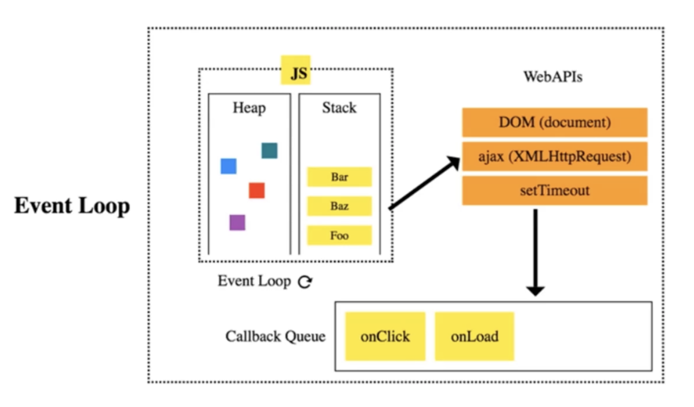
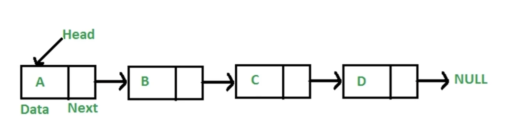

---
nav:
  title: 🏦 数据结构与算法
title: 基础
order: 1
---

## 时间复杂度与空间复杂度

时间复杂度与空间复杂度用来衡量算法的性能，算法可能在一定时间内都需要不断优化，优化过程需要同时兼顾代码可读性与代码运行性能。

时间复杂度我们一般使用大 O 表示法，常见时间复杂度表示如下所示：

- $O(1)$
- $O(log_n)$
- $O(n)$
- $O(n^2)$

性能由上至下一次降低。

空间复杂度我们一般使用大 S 表示法，例如 $S(n)$、$S(1)$。

## 栈

栈是非常常见的一种数据结构，很多算法中都需要使用栈作为辅助。栈的特性可归纳为：

- 先进后出

常见栈的应用有：

- 括号匹配
- 作为工具，用于遍历数或图

### 经典题

**请使用栈完成二叉树的前序遍历**

```js
function traverse(root) {
  const res = [];
  const stack = [];
  if (root) stack.push(root);
  while (stack.length) {
    const n = stack.pop();
    res.push(n.val);
    const { left, right } = n;
    if (right) stack.push(right);
    if (left) stack.push(left);
  }
  return res;
}
```

## 队列

队列用于解决**先进先出**的问题，保证有序性。在 JavaScript 异步处理中，存在任务队列以调度异步任务。

常见队列的应用有：

- react 中的调度
- 任务队列

### 经典题

**请使用队列统计最近请求次数**

```js
function RecentCounter() {
  this.q = [];
}

RecentCounter.prototype.ping = function(t) {
  this.q.push(t);
  while (this.q[0] < t - 3000) {
    this.q.shift();
  }
  return this.q.length;
};
```

浏览器 JavaScript 中的事件队列



## 链表

链表可用于存储不连续的数据，通常前后节点的关系使用指针来确立（next），在有些场景下链表中每个节点上可能既存在前指针，又存在后指针。普通链表示例如下：



对于链表相关的算法，常用的技巧有一下几点：

- 双指针【反转链表】
- 快慢指针【判断链表是否有环】

### 经典题

**反转链表**

反转链表运用到了双指针的技巧，整体分析可能会觉得比较复杂，我们不妨两个节点一分析，链表的反转其实是将前后两个节点顺序交换，最终输出生成后的链表。

```js
function reverse(head) {
  // 首先建立两个指针
  let p1 = head;
  let p2 = null;

  while (p1) {
    const temp = p1.next;
    p1.next = p2;
    p2 = p1;
    p1 = temp;
  }
  return p2;
}
```

---

**判断链表是否有环**

判断链表是否有环是一个很经典的算法题，我们联想到解过的数学题，两个运动员同时从起点出发围绕跑到赛跑，跑得快可能会和跑得慢的运动员相遇，由此我们抽象出了两个指针——快慢指针，在遍历链表的过程中，快指针每次走两步，慢指针每次走一步，若快慢指针相遇，则当前遍历到的为同一个节点。

```js
function linkHasCycle(head) {
  // 两个指针，快慢指针
  let p1 = head;
  let p2 = head;

  while (p1 && p2 && p2.next) {
    p1 = p1.next;
    p2 = p2.next.next;
    // 如果此时 p1 === p2，证明为同一个节点，即链表成环
    if (p1 === p2) {
      return true;
    }
  }
  return false;
}
```

---

**JavaScript 中原型继承的应用**

请实现 instanceOf？

instanceOf 的原理是遍历原型链，通过对比原型链上的 **proto** 属性是否等于给定的 prototype，等于则返回 true，否则返回 false。

```js
function instanceOf(A, B) {
  let p = A;
  while (p) {
    if (p === B.prototype) {
      return true;
    }
    p = p.__proto__;
  }
  return false;
}

// 进行验证
instanceOf([], Array); // true
```

## 集合

JavaScript 也加入了集合的概念，即 Set，集合的特点为：

- 元素无重复
- 存储随机且不连续

我们通常使用 Set 来解决去重问题，辅助数组的一些操作。

```js
const arr = [1, 2, 2, 3];
const uniqArr = [...new Set(arr)]; // [1, 2, 3]
```

### 经典题

**求两个数组的交集**

给定两个数组：[1, 2, 2, 1]、[2, 2]，输出两者交集 [2]。

```js
function intersection(nums1, nums2) {
  return [...new Set(nums1)].filter(n => nums2.includes(n));
}
```

## 字典

JavaScript 也加入了字典，即 Map，字典的特点：

- 满足 key-value 形式
- 随机存储

其中还有 WeakMap，弱引用，将对象作为键，利于垃圾回收。

### 经典题

**求两个数组的交集**

给定两个数组：[1, 2, 2, 1]、[2, 2]，输出两者交集 [2]。这道题目我们可以使用字典来进行优化。即将 nums1 中的元素先添加到字典映射中，然后遍历 nums2，如果遍历到的元素在字典映射中有值则记录该值并将这个值从 nums2 中移除，以此求得两数组交集。

```js
function intersection(nums1, nums2) {
  // const map;
}
```

---

**无重复字符的最长子串**

给定一个字符串，求该字符串的无重复字符最长子串。使用双指针滑动窗口，当扫描到的左右指针对应的值相等时，则将左指针向右移动一位，最终右指针指向字符串最后一个值时，扫描结束，返回此时窗口所包含的子串。

```js
function lengthOfLongestSubstring(s) {
  let l = 0;
  let len = 0;
  const map = new Map();
  for (let r = 0; r < s.length; r++) {
    // 获取当前右指针指向元素
    const e = s[r];
    const mapVal = map.get(e);
    if (map.has(e) && mapVal >= l) {
      // 此时将作指针移动到不重复的元素上
      l = mapVal + 1;
    }
    len = Math.max(len, r - l + 1);
    // 记录对应元素的索引
    map.set(e, r);
  }
  return len;
}
```

---

**最小覆盖子串**

给定一个字符串 S，一个字符串 T，请在 S 中找到包含 T 所有字符的最小子串。

LeetCode 76
输入：s = "ADOBECODEBANC", t = "ABC"
输出："BANC

使用滑动窗口，定义左右指针，首先将右指针向右移动。

```js
/**
 * 给你一个字符串 s 、一个字符串 t 。返回 s 中涵盖 t 所有字符的最小子串。如果 s 中不存在涵盖 t 所有字符的子串，则返回空字符串 "" 。
 * 注意：如果 s 中存在这样的子串，我们保证它是唯一的答案。
 *
 * 输入：s = "ADOBECODEBANC", t = "ABC"
 * 输出："BANC"
 *
 * @param {string} s
 * @param {string} t
 */
function minWindow(s, t) {
  // 初始化两个指针
  let left = 0;
  let right = 0;

  // 首先将 t 中元素存入 map 中，记录每个元素所需要的个数
  const needsMap = new Map();
  for (let char of t) {
    needsMap.set(char, needsMap.has(char) ? needsMap.get(char) + 1 : 1);
  }

  // 记录一个当前所需匹配值数，默认为 t 的长度
  let currentNeedLen = t.length;

  // 存储返回结果
  let resStr = '';

  // 滑动右指针
  while (right <= s.length) {
    const c1 = s[right];
    // 消费 map 中的数据，将所需个数匹配至 0
    if (needsMap.has(c1)) {
      needsMap.set(c1, needsMap.get(c1) - 1);
      // 如果对应的元素还需个数为0，则表示已经的值包含了该元素所有个数
      if (needsMap.get(c1) === 0) currentNeedLen -= 1;
    }

    // 移动左指针以缩小字符串长度
    while (currentNeedLen === 0) {
      const newStr = s.slice(left, right + 1);
      resStr = !resStr || resStr.length > newStr.length ? newStr : resStr;
      const c2 = s[left];
      // 如果剔除的左边元素剔除后对于匹配元素无影响，则可以继续剔除
      if (needsMap.has(c2)) {
        needsMap.set(c2, needsMap.get(c2) + 1);
        if (needsMap.get(c2) === 1) {
          currentNeedLen += 1;
        }
      }
      left += 1;
    }
    // 向右移动右指针
    right++;
  }

  return resStr;
}

console.log(minWindow('ADOBECODEBANC', 'ABC'));
```

## 树

树通常用来表征结构化具有层级特征的数据，例如公司组织架构，中国省市区县层级划分等数据均可使用树这一数据结构呈现与存储。

以省市区县为例，可以用树这样来表示：

```
湖北省
	|
	|--武汉市
	|		 |
	|    |--洪山区
	|
	|
	|--黄冈市
```

在 JavaScript 语言中，表示树可以有几种形式

1. 将树中同一层级树节点存储在数组中
2. 通过指针连接各节点

形式一我们可以像如下进行表示：

```js
const provinces = [
  {
    name: '湖北省',
    children: [
      {
        name: '武汉市',
        children: [
          {
            name: '洪山区',
          },
        ],
      },
      {
        name: '黄冈市',
      },
    ],
  },
];
```

这种形式可以轻易表示多叉树。

形式二我们可以像如下进行表示：

```js
const data = {
  value: 0,
  left: {
    value: 1,
    left: {
      value: 3,
    },
  },
  right: {
    value: 2,
  },
};
```

通过这种形式，可以轻易表示二叉树。

### 基础算法

基础算法包括树的遍历，这里介绍树的层级遍历、深度优先遍历。

#### 多叉树

**层级遍历**

层级遍历通常用来遍历多叉树，遍历过程可借助队列这一数据结构实现，代码如下：

```js
function traverse(tree) {
  const stack = [];
  stack.push(tree);
  while (stack.length) {
    const current = stack.shift();
    console.log(current.value);
    if (current.children)
      current.children.forEach(te => {
        stack.push(te);
      });
  }
}

const treeData = {
  value: 0,
  children: [
    {
      value: 1,
      children: [
        {
          value: 3,
        },
        {
          value: 4,
        },
      ],
    },
    {
      value: 2,
    },
  ],
};

traverse(treeData);
// 代码输出：0 1 2 3 4
```

**深度遍历**

深度遍历我们首先能想到通过递归实现，因为递归本身就是基于函数栈这一原理实现。同时我们还可以通过栈这一数据结构，完成树的深度遍历。

- 递归实现

```js
function traverse(tree) {
  console.log(tree);
  if (tree.children) {
    tree.children.forEach(traverse1);
  }
}

const treeData = {
  value: 0,
  children: [
    {
      value: 1,
      children: [
        {
          value: 3,
        },
        {
          value: 4,
        },
      ],
    },
    {
      value: 2,
    },
  ],
};

traverse(treeData);
```

#### 二叉树

二叉树的遍历也可分为层级遍历、前序遍历、中序遍历、后序遍历。此处前中后序表示访问根节点的时机，例如前序遍历表示先访问根节点，然后访问左子树，最后访问右子树。

**递归实现前中后序遍历**

```js
// 前序遍历
function preTraverse(tree) {
  if (!tree) return;
  console.log(tree.value);
  preTraverse(tree.left);
  preTraverse(tree.right);
}

// 中序遍历
function inTraverse(tree) {
  if (!tree) return;
  inTraverse(tree.left);
  console.log(tree.value);
  inTraverse(tree.right);
}

// 后序遍历
function postTraverse(tree) {
  if (!tree) return;
  postTraverse(tree.left);
  postTraverse(tree.right);
  console.log(tree.value);
}
```

**非递归实现前中后序遍历**

```js
// 前序遍历
function preTraverseStack(root) {
  const res = [];
  const stack = [];
  if (root) stack.push(root);
  while (stack.length) {
    const n = stack.pop();
    res.push(n.value);
    const { left, right } = n;
    if (right) stack.push(right);
    if (left) stack.push(left);
  }
  return res;
}

// 中序遍历
function inTraverseStack(tree) {
  // 首先不断压栈到最左边子树
  let p = tree;
  const arr = [];
  const res = [];
  while (p || arr.length !== 0) {
    if (p) {
      // 如果 p 存在，则一直进行压栈
      arr.push(p);
      p = p.left;
    } else {
      // 当当前节点没有左子树时，则出栈
      let node = arr.pop();
      // 访问节点
      res.push(node.value);
      p = node.right;
    }
  }
  return res;
}

// 后序遍历
function postTraverseStack(tree) {
  const arr = [tree];
  const res = [];
  while (arr.length !== 0) {
    let node = arr.pop();
    res.push(node.value);
    if (node.left) arr.push(node.left);
    if (node.right) arr.push(node.right);
  }
  return res.reverse();
}
```

### 经典题

**求二叉树的最大深度**

例如考察二叉树的最大深度，则是在树的深度遍历基础上进行改进。示例如下

```js
function maxDepth(root) {
  let res = 0;
  const dfs = (r, l) => {
    if (!r) return;
    res = Math.max(res, l);
    dfs(r.left, l + 1);
    dfs(r.right, l + 1);
  };
  dfs(root, 1);

  return res;
}

const data = {
  value: 1,
  left: {
    value: 2,
    left: {
      value: 3,
    },
  },
  right: {
    value: 4,
  },
};

console.log(maxDepth(data));
```

通过这个考题联想到另外一个，找出二叉树的所有路径。

```js
function getTreeGraph(root) {
  const paths = [];

  const dfs = (r, path, p) => {
    if (!r) {
      // 其中 !p.left && !p.right 表示当前节点为叶子节点
      if (!p.left && !p.right && !paths.includes(path)) {
        paths.push(path);
      }
      return;
    }
    const { left: rLeft, right: rRight } = r;
    dfs(rLeft, `${path}${rLeft?.value ? `-${rLeft?.value}` : ''}`, r);
    dfs(rRight, `${path}${rRight?.value ? `-${rRight?.value}` : ''}`, r);
  };
  dfs(root, root.value, null);

  return paths;
}

const data = {
  value: 1,
  left: {
    value: 2,
    left: {
      value: 3,
    },
  },
  right: {
    value: 4,
  },
};

console.log(getTreeGraph(data));
// 输出：[ '1-2-3', '1-4' ]
```

**将二叉树节点存储到数组中**

有两种方法，代码实现如下：

```js
function levelOrder(root) {
  if (!root) return [];
  const nodes = [[root, 0]];
  const result = [];
  while (nodes.length) {
    const [n, l] = nodes.shift();
    if (result[l]) {
      result[l].push(n.value);
    } else {
      result[l] = [n.value];
    }
    if (n.left) nodes.push([n.left, l + 1]);
    if (n.right) nodes.push([n.right, l + 1]);
  }
  return result;
}
```

或者

```js
function levelOrder(root) {
  if (!root) return [];
  const q = [root];
  const result = [];
  while (q.length) {
    let len = q.length;
    result.push([]);
    while (len--) {
      const n = q.shift();
      result[result.length - 1].push(n.value);
      if (n.left) q.push(n.left);
      if (n.right) q.push(n.right);
    }
  }
  return result;
}
```

测试如下

```js
const data = {
  value: 1,
  left: {
    value: 2,
    left: {
      value: 3,
    },
  },
  right: {
    value: 4,
  },
};

console.log(levelOrder(data));

// 输出树层级
/**
 * [
 *    [1],
 *    [2, 4],
 *    [3]
 * ]
 */
```

## 图

通常使用**邻接矩阵**、**邻接表**或**关联矩阵**表示图的节点与边信息。

**邻接矩阵：**

```
	A B C D
A 0 1 0 0
B 1 0 1 0
C 0 1 0 0
D 0 0 0 0
```

**邻接表：**

```
{
	0: [1, 2],
	1: [2, 3],
	2: [3],
	3: [1]
}
```

通常，我们倾向使用邻接表表征图。

### 基础算法

**图的深度优先遍历**

给定邻接表表示图：

```js
const graph = {
  0: [1, 2],
  1: [2],
  2: [0, 3],
  3: [3],
};
```

通过深度优先遍历方式，遍历该图。

```js
function graphDepthVisit(g, n) {
  const visited = new Set();

  function dfs(n) {
    console.log(n);
    visited.add(n);
    g[n].forEach(e => {
      if (!visited.has(e)) {
        dfs(e);
      }
    });
  }
  dfs(n);
}

graphDepthVisit(graph, 1);

// 1 2 0 3
```

**图的广度优先遍历**

```js
function graphBreadthVisit(g, n) {
  const q = [n];
  const visited = new Set(q);
  while (q.length) {
    const c = q.shift();
    console.log(c);
    g[c].forEach(e => {
      if (!visited.has(e)) {
        q.push(e);
        visited.add(e);
      }
    });
  }
}

graphBreadthVisit(graph, 2);

// 2 0 3 1
```

## 堆

堆本质是树，是完全二叉树。堆可以分为最小堆、最大堆。

- 最小堆：每个根节点值都小于其子节点值
- 最大堆：每个根节点值都大于其子节点值

在 JavaScript 中，可以使用数组来存储堆。

```
.
          1(0)

       3(1)   6(2)

	5(3)  9(4)   8(5)
```

存储如：[1, 3, 6, 5, 9, 8]

存储有以下特点：

- 左侧子节点在数组中存储位置是 2 \* index + 1;
- 右侧子节点在数组中存储位置是 2 \* index + 2;
- 父节点在数组中存储位置是 (index - 1) / 2；

**主要应用**

1. 堆能高效、快速地找到最大（小）值，时间复杂度为 o(1)
2. 找出第 K 个最大（小）元素

### 基础算法

构建最小堆，完成元素插入、删除。有两个核心算法需要注意：

1. 插入时，插入值不断上移，直至满足堆条件
2. 删除时，先将堆尾元素填补在堆首，然后不断下移，直至满足堆条件

构建一个最小堆，代码如下：

```js
class MinHeap < E > {
    /**
     * Storage heap data
     */
    private heap: E[];

    constructor() {
        this.heap = [];
    }

    /**
     * get current superior element index
     * @param index
     * @returns
     */
    private getSuperiorIndex(index: number) {
        return (index - 1) >> 1;
    }

    /**
     * get current subordinate index
     * @param index
     * @returns
     */
    private getSubordinateIndexs(index: number) {
        return [index * 2 + 1, index * 2 + 2];
    }

    /**
     * swap
     * @param i1
     * @param i2
     */
    private swap(i1: number, i2: number) {
        const temp = this.heap[i1];
        this.heap[i1] = this.heap[i2];
        this.heap[i2] = temp;
    }

    /**
     * Move element up
     * @param index
     */
    private moveUp(index: number) {
        if (index === 0) return;
        const superiorIndex = this.getSuperiorIndex(index);
        if (this.heap[superiorIndex] > this.heap[index]) {
            this.swap(superiorIndex, index);
            this.moveUp(superiorIndex);
        }
    }

    /**
     * Move element down
     * @param index
     */
    private moveDown(index: number) {
        const subIndexs = this.getSubordinateIndexs(index);
        subIndexs.forEach(subIndex => {
            if (this.heap[subIndex] < this.heap[index]) {
                this.swap(subIndex, index);
                this.moveDown(subIndex);
            }
        });
    }

    /**
     * Insert data into heap
     * @param value
     */
    insert(value: E) {
        this.heap.push(value);
        // Adjust data location
        this.moveUp(this.heap.length - 1);
    }

    /**
     * Pop up top element
     */
    pop() {
        if (!this.size()) return;
        this.heap[0] = this.heap.pop() as E;
        this.moveDown(0);
    }

    /**
     * peek heap
     * @returns E
     */
    peek() {
        return this.heap[0];
    }

    /**
     * return heap size
     * @returns number
     */
    size() {
        return this.heap.length;
    }
}

const minHeap = new MinHeap < number > ();
minHeap.insert(3);
minHeap.insert(2);
minHeap.insert(1);
minHeap.pop()
```

### 经典题

**返回给定数组第 K 大元素**

```js
// 使用最小堆
const minHeap = new MinHeap();
// 给定数据
const data = [3, 2, 1, 5, 6, 4];
// k = 2，第2大元素
data.forEach(d => {
  minHeap.insert(d);
  if (minHeap.size() > 2) {
    minHeap.pop();
  }
});

minHeap.peek();
```

**数组中前 K 个高频元素**

给定 [1, 2, 1, 1, 2, 3]及 k=2，返回[1, 2]

此题通过 map 与最小堆辅助完成。

```js
function topFrequent(nums, k) {
  const minHeap = new MinHeap();
  const map = new Map();
  nums.forEach(d => {
    map.set(d, map.get(d) ? map.get(d) + 1 : 1);
  });
  map.forEach((value, key) => {
    minHeap.insert({
      value,
      key,
    });
    if (minHeap.size() > k) {
      minHeap.pop();
    }
  });
  return minHeap.heap.map(h => h.key);
}

console.log(topFrequent([2, 2, 1, 1, 1, 4, 3], 2));
```

此处 MinHeap 在上移和下移操作中做了细微调整，如下：

```js
this.heap[superiorIndex] &&
  this.heap[superiorIndex].value > this.heap[index].value;
```

以及

```js
this.heap[subIndex] && this.heap[subIndex].value < this.heap[index].value;
```

**合并 K 个排序链表**
